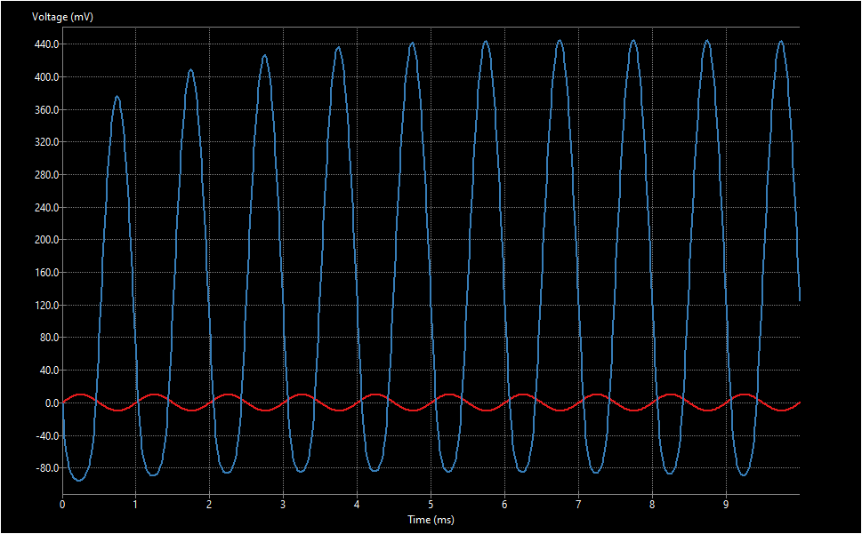
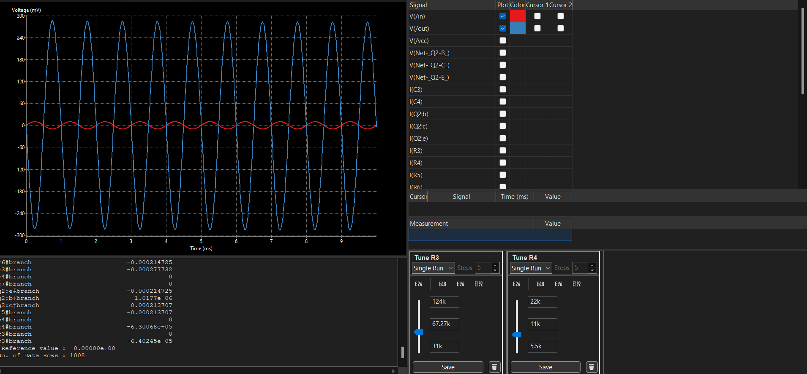
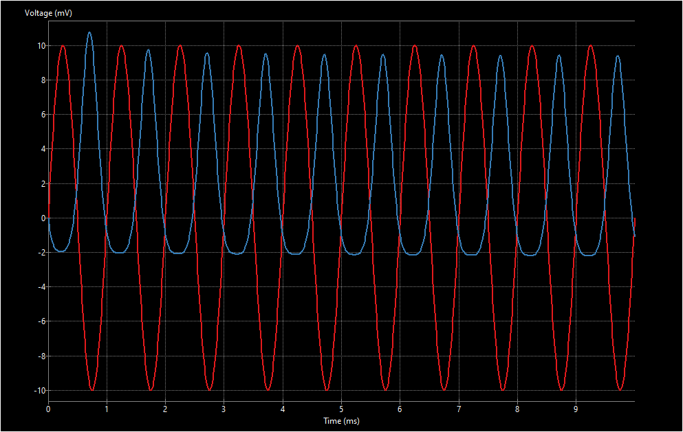
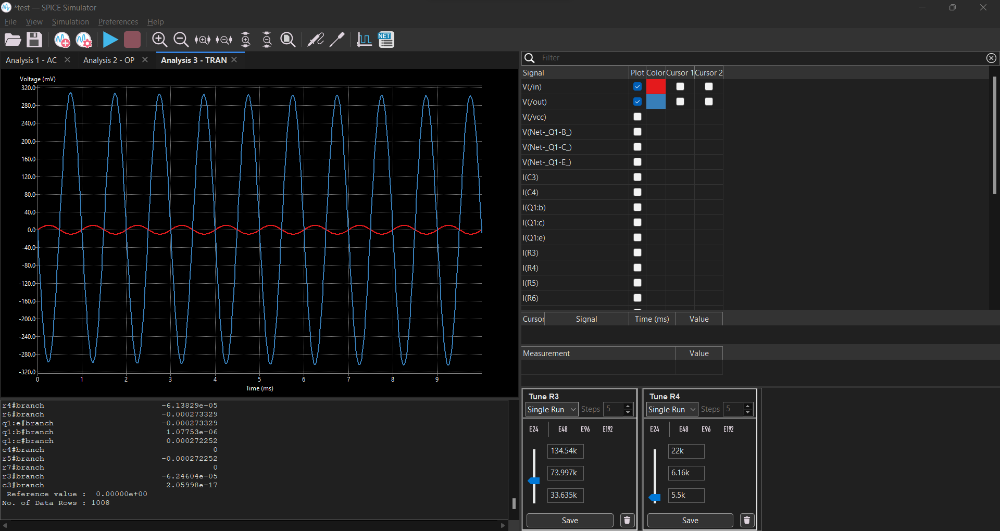
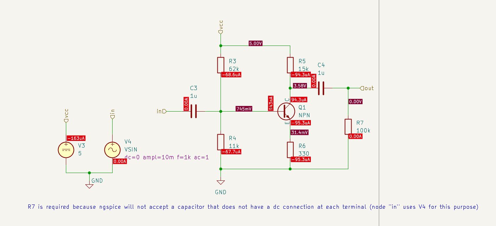
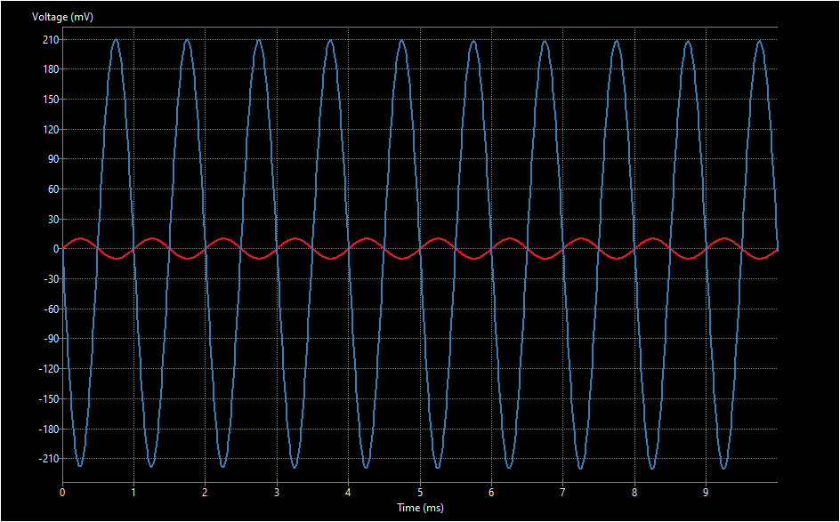

# Bipolar Amplifier Simulation — KiCad + ngspice

A common-emitter BJT amplifier designed and simulated in **KiCad 8 (Eeschema)** using the built-in **ngspice** engine. The project compares a generic NPN transistor model against two real-world SPICE models (**BC546** and **BC817-40**), and demonstrates manual bias-point tuning to restore correct amplifier behavior after swapping transistor models.

## Project Goal

Practicing full-circuit simulation workflow in KiCad:
- Schematic capture with SPICE-ready symbols
- Importing manufacturer SPICE models (`.lib`) for real transistors
- Running Operating Point (OP) and Transient (TRAN) analyses
- Using the interactive tuning tool to re-bias the circuit after a component swap

## Circuit Description

Common-emitter single-stage BJT amplifier:
- **R2, R3** — base bias resistors (voltage divider)
- **R1** — collector (DC) load
- **R5** — emitter resistor (negative feedback / bias stability)
- **C1, C2** — input/output coupling capacitors
- **R4** — required by ngspice so the input coupling capacitor has a DC path to ground
- **V1** — 5V DC supply (Vcc)
- **V2** — 10 mV, 1 kHz sine input (VSIN)

## Workflow

### 1. Generic NPN Transistor
Started with the built-in generic NPN model from the `Simulation_SPICE` library to validate the topology.

### 2. Real Transistor — BC546
Replaced the generic symbol with the BC546 (same C-B-E pin order), and attached the manufacturer's `BC546.lib` SPICE model. Since the BC546's real parameters differ from the generic model's defaults, the amplifier output was initially distorted (wrong bias point).

**Fix:** used KiCad's built-in **tuning sliders** (Simulator → Tune) to sweep R2 and R3 live and find the bias point that restores a clean sine wave output.

| Before Tuning | After Tuning |
|---|---|
|  |  |

### 3. Real Transistor — BC817-40
Repeated the process with the BC817-40 (SOT-23 package), whose SPICE model was sourced from Diodes Incorporated. This transistor's pin order **does not match** ngspice's expected C-B-E sequence, so a manual **Pin Assignment** remap was required inside the Simulation Model Editor.

| Before Tuning | After Tuning |
|---|---|
|  |  |

### 4. Verification
Ran an **Operating Point (OP)** analysis to confirm bias voltages/currents across the circuit, and a **Transient (TRAN)** analysis to confirm clean amplification of the 1 kHz input sine wave.

## A Debugging Note

While importing the BC817-40 model directly from the manufacturer's datasheet text, ngspice threw:
Root cause: a multi-line SPICE comment had wrapped onto a second line that didn't start with `*`, so ngspice tried to parse the trailing text (`Inc. BJTs`) as a component definition — the leading `I` was read as a current source declaration. Fixed by merging the comment back onto a single line. A good reminder that **every line in a raw vendor SPICE file needs to be valid syntax**, even "just" a comment.

## Files

| File / Folder | Description |
|---|---|
| `bipolar_amplifier.kicad_sch` | Main schematic |
| `bipolar_amplifier.kicad_pro` | KiCad project file |
| `bipolar_amplifier.kicad_pcb` | PCB file (placeholder — layout not yet done) |
| `models/BC546.lib` | BC546 SPICE model |
| `models/BC817-40.lib` | BC817-40 SPICE model (Diodes Inc.) |
| `screenshots/` | Simulation results at each stage |

## Tools Used

- KiCad 8 (Eeschema + integrated ngspice-42 Spice Simulator)
- Manufacturer SPICE models (ON Semi / Diodes Inc.)

## Reference

Tutorial followed: [ngspice + KiCad/Eeschema simulation guide](https://ngspice.sourceforge.io/) by Holger Vogt.

---
**Author:** Karim Adel — Junior Analog/Mixed-Signal Layout Engineer, learning PCB/circuit design with KiCad.
